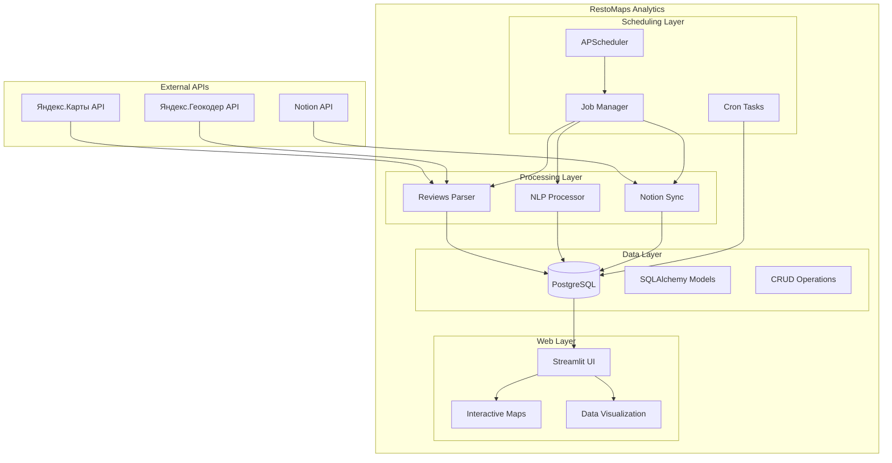
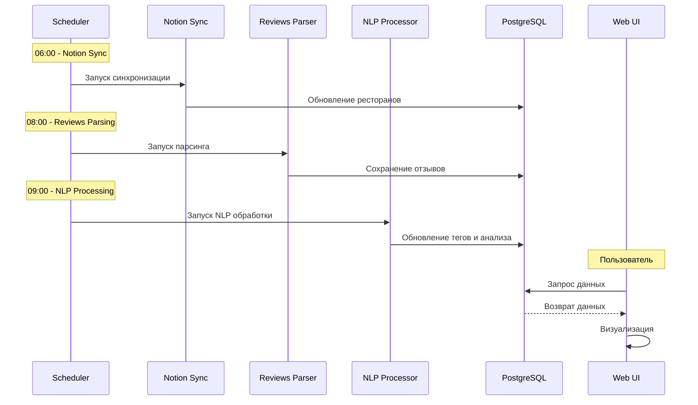
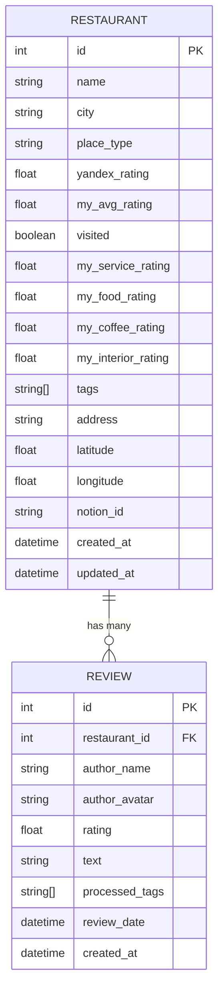
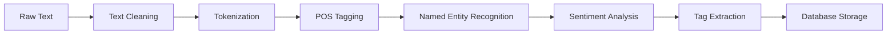

# 🔧 Technical Documentation

## Архитектура системы

### Общая схема



### Поток данных



## Структура базы данных

### ER-диаграмма



### Модели данных

#### Restaurant (Ресторан)
```python
class Restaurant(Base):
    __tablename__ = 'restaurants'
    
    id = Column(Integer, primary_key=True)
    name = Column(String(255), nullable=False)
    city = Column(String(100))
    place_type = Column(String(100))
    yandex_rating = Column(Float)
    my_avg_rating = Column(Float)
    visited = Column(Boolean, default=False)
    my_service_rating = Column(Float)
    my_food_rating = Column(Float)
    my_coffee_rating = Column(Float)
    my_interior_rating = Column(Float)
    tags = Column(ARRAY(String))
    address = Column(Text)
    latitude = Column(Float)
    longitude = Column(Float)
    notion_id = Column(String(100), unique=True)
    created_at = Column(DateTime, default=datetime.utcnow)
    updated_at = Column(DateTime, default=datetime.utcnow, onupdate=datetime.utcnow)
    
    reviews = relationship("Review", back_populates="restaurant")
```

#### Review (Отзыв)
```python
class Review(Base):
    __tablename__ = 'reviews'
    
    id = Column(Integer, primary_key=True)
    restaurant_id = Column(Integer, ForeignKey('restaurants.id'))
    author_name = Column(String(255))
    author_avatar = Column(String(500))
    rating = Column(Float)
    text = Column(Text)
    processed_tags = Column(ARRAY(String))
    review_date = Column(DateTime)
    created_at = Column(DateTime, default=datetime.utcnow)
    
    restaurant = relationship("Restaurant", back_populates="reviews")
```

## API интеграции

### Яндекс.Карты API

#### Получение отзывов
```python
def parse_reviews_for_restaurant(restaurant_url: str) -> List[Dict]:
    """Парсинг отзывов с Яндекс.Карт"""
    
    # Настройка Selenium WebDriver
    options = webdriver.ChromeOptions()
    options.add_argument('--headless')
    driver = webdriver.Chrome(options=options)
    
    try:
        driver.get(restaurant_url)
        
        # Ожидание загрузки отзывов
        WebDriverWait(driver, 10).until(
            EC.presence_of_element_located((By.CLASS_NAME, "business-reviews-card-view__review"))
        )
        
        reviews = []
        review_elements = driver.find_elements(By.CLASS_NAME, "business-reviews-card-view__review")
        
        for element in review_elements:
            review_data = extract_review_data(element)
            reviews.append(review_data)
            
        return reviews
        
    finally:
        driver.quit()
```

### Notion API

#### Синхронизация данных
```python
def sync_notion_to_database():
    """Синхронизация данных из Notion с базой данных"""
    
    notion = Client(auth=NOTION_API_KEY)
    
    # Получение данных из Notion
    notion_data = notion.databases.query(
        database_id=NOTION_DATABASE_ID,
        page_size=100
    )
    
    for page in notion_data['results']:
        restaurant_data = parse_notion_page(page)
        
        # Поиск или создание ресторана
        restaurant = get_or_create_restaurant(restaurant_data)
        
        # Обновление данных
        update_restaurant_data(restaurant, restaurant_data)
```

## NLP Pipeline

### Обработка текстов



### spaCy Pipeline

```python
import spacy
from textblob import TextBlob

class NLPProcessor:
    def __init__(self):
        self.nlp = spacy.load("ru_core_news_sm")
    
    def process_text(self, text: str) -> Dict:
        """Обработка текста отзыва"""
        
        # Очистка текста
        cleaned_text = self.clean_text(text)
        
        # spaCy обработка
        doc = self.nlp(cleaned_text)
        
        # Извлечение сущностей
        entities = [(ent.text, ent.label_) for ent in doc.ents]
        
        # Анализ тональности
        blob = TextBlob(cleaned_text)
        sentiment = blob.sentiment.polarity
        
        # Извлечение тегов
        tags = self.extract_tags(doc)
        
        return {
            'entities': entities,
            'sentiment': sentiment,
            'tags': tags,
            'processed_text': cleaned_text
        }
```

## Планировщик задач

### APScheduler Configuration

```python
from apscheduler.schedulers.blocking import BlockingScheduler

class JobManager:
    def __init__(self):
        self.scheduler = BlockingScheduler()
        self._setup_jobs()
    
    def _setup_jobs(self):
        """Настройка запланированных задач"""
        
        # Notion Sync - 06:00
        self.scheduler.add_job(
            func=self.run_notion_sync,
            trigger='cron',
            hour=6,
            minute=0,
            id='notion_sync',
            name='Notion Synchronization'
        )
        
        # Reviews Parsing - 08:00
        self.scheduler.add_job(
            func=self.run_reviews_parsing,
            trigger='cron',
            hour=8,
            minute=0,
            id='reviews_parsing',
            name='Reviews Parsing'
        )
        
        # NLP Processing - 09:00
        self.scheduler.add_job(
            func=self.run_nlp_processing,
            trigger='cron',
            hour=9,
            minute=0,
            id='nlp_processing',
            name='NLP Processing'
        )
```

### Cron Jobs (Backup)

```bash
# /etc/crontab
0 2 * * * /path/to/backup.sh backup >> /path/to/logs/backup.log 2>&1
```

## Веб-интерфейс

### Streamlit Architecture

```python
# main.py
import streamlit as st

def main():
    st.set_page_config(
        page_title="RestoMaps Analytics",
        page_icon="🍽️",
        layout="wide"
    )
    
    # Загрузка данных
    restaurants_df = load_restaurants_data()
    
    # Боковая панель с фильтрами
    filters = render_filters()
    
    # Основной контент
    filtered_data = apply_filters(restaurants_df, filters)
    
    # Отображение данных
    render_dashboard(filtered_data)
```

### Компоненты UI

#### Карты
```python
def render_folium_map(data: pd.DataFrame):
    """Отображение интерактивной карты"""
    
    # Создание карты
    m = folium.Map(
        location=[data['latitude'].mean(), data['longitude'].mean()],
        zoom_start=10
    )
    
    # Добавление маркеров
    for _, restaurant in data.iterrows():
        folium.Marker(
            location=[restaurant['latitude'], restaurant['longitude']],
            popup=create_popup(restaurant),
            icon=create_icon(restaurant)
        ).add_to(m)
    
    return m
```

#### Графики
```python
def render_rating_distribution(data: pd.DataFrame):
    """Распределение рейтингов"""
    
    fig = px.histogram(
        data,
        x='yandex_rating',
        nbins=20,
        title="Распределение рейтингов"
    )
    
    return fig
```

## Производительность

### Оптимизация запросов

```python
# Эффективная загрузка данных с пагинацией
def load_restaurants_paginated(page: int, page_size: int = 100):
    """Загрузка ресторанов с пагинацией"""
    
    offset = page * page_size
    
    query = session.query(Restaurant)\
        .options(joinedload(Restaurant.reviews))\
        .offset(offset)\
        .limit(page_size)
    
    return query.all()

# Кэширование часто используемых данных
@st.cache_data
def load_cities_list():
    """Кэшированный список городов"""
    return session.query(Restaurant.city).distinct().all()
```

### Индексы базы данных

```sql
-- Индексы для оптимизации запросов
CREATE INDEX idx_restaurants_city ON restaurants(city);
CREATE INDEX idx_restaurants_rating ON restaurants(yandex_rating);
CREATE INDEX idx_reviews_restaurant_id ON reviews(restaurant_id);
CREATE INDEX idx_reviews_date ON reviews(review_date);
```

## Мониторинг и логирование

### Структура логов

```python
import loguru

# Настройка логирования
logger.add(
    "logs/app_{time}.log",
    rotation="1 day",
    retention="30 days",
    level="INFO",
    format="{time:YYYY-MM-DD HH:mm:ss} | {level} | {name}:{function}:{line} | {message}"
)
```

### Метрики производительности

```python
def track_performance(func):
    """Декоратор для отслеживания производительности"""
    
    @wraps(func)
    def wrapper(*args, **kwargs):
        start_time = time.time()
        result = func(*args, **kwargs)
        execution_time = time.time() - start_time
        
        logger.info(f"{func.__name__} executed in {execution_time:.2f}s")
        return result
    
    return wrapper
```

## Безопасность

### Управление секретами

```python
# config/settings.py
import os
from dotenv import load_dotenv

load_dotenv()

class Settings:
    # API ключи
    NOTION_API_KEY = os.getenv('NOTION_API_KEY')
    YA_GEO_CODER_API_KEY = os.getenv('YA_GEO_CODER_API_KEY')
    
    # База данных
    POSTGRES_USER = os.getenv('POSTGRES_USER')
    POSTGRES_PASSWORD = os.getenv('POSTGRES_PASSWORD')
    POSTGRES_HOST = os.getenv('POSTGRES_HOST', 'localhost')
    POSTGRES_PORT = os.getenv('POSTGRES_PORT', '5432')
    POSTGRES_DB = os.getenv('POSTGRES_DB')
```

### Валидация данных

```python
from pydantic import BaseModel, validator

class RestaurantData(BaseModel):
    name: str
    city: str
    yandex_rating: Optional[float] = None
    
    @validator('yandex_rating')
    def validate_rating(cls, v):
        if v is not None and (v < 0 or v > 5):
            raise ValueError('Rating must be between 0 and 5')
        return v
```

## CLI Interface (Click)

### Click Commands

Система использует Click для создания удобного командного интерфейса:

```python
# main.py
import click
from core.app import run_ui
from core.job_manager import JobManager

@click.group()
def cli():
    """RestoMaps Analytics - система анализа ресторанов"""
    pass

@cli.command()
def ui():
    """Запуск веб-интерфейса"""
    run_ui()

@cli.command()
def notion():
    """Синхронизация с Notion"""
    job_manager = JobManager()
    job_manager.run_notion_sync()

@cli.command()
def reviews():
    """Парсинг отзывов с Яндекс.Карт"""
    job_manager = JobManager()
    job_manager.run_reviews_parsing()

@cli.command()
@click.option("--limit", "-l", type=int, default=20, help="Ограничить количество проверяемых ресторанов")
def check_failed(limit):
    """Повторная проверка ресторанов с ошибками"""
    job_manager = JobManager()
    job_manager.run_failed_restaurants_check(limit_restaurants=limit)

@cli.command()
def init_db():
    """Инициализация базы данных"""
    from database.database_manager import init_database
    init_database()

@cli.command()
def scheduler():
    """Запуск планировщика задач"""
    from core.scheduler import run_scheduler
    run_scheduler()

if __name__ == "__main__":
    cli()
```

### Click Features

- **Автоматическая генерация help** - `python main.py --help`
- **Валидация параметров** - автоматическая проверка типов
- **Цветной вывод** - улучшенный UX в терминале
- **Группировка команд** - логическая организация функций

## Code Quality (Ruff)

### Ruff Configuration

```toml
# pyproject.toml
[tool.ruff]
exclude = [
    ".git", ".venv", "__pycache__", "*.pyc", 
    ".pytest_cache", "logs", "backups"
]
line-length = 88
target-version = "py311"

[tool.ruff.lint]
select = [
    "E", "W", "F", "I", "B", "C4", "UP", "ARG", 
    "SIM", "TCH", "TID", "Q", "S", "N", "D", 
    "RET", "PIE", "T20", "PT", "RUF"
]
ignore = [
    "D100", "D101", "D102", "D103", "D104", "D105", "D107",
    "D203", "D213", "D400", "D401", "D415", "S101", "S104",
    "S108", "S603", "S607", "T201", "PLR0913", "PLR0912",
    "PLR0915", "PLR2004", "RET504", "RET505", "RUF012",
    "RUF001", "RUF002", "RUF003", "E501"
]

[tool.ruff.lint.isort]
known-first-party = ["database", "parsers", "ui", "core", "jobs", "scripts", "config"]
force-sort-within-sections = true
split-on-trailing-comma = true

[tool.ruff.lint.pydocstyle]
convention = "google"

[tool.ruff.lint.flake8-quotes]
docstring-quotes = "double"
inline-quotes = "double"
```

### Ruff Commands

```bash
# Линтинг
ruff check .

# Форматирование
ruff format .

# Автоисправление
ruff check --fix .

# Проверка конкретного файла
ruff check parsers/ya_maps_reviews_parser.py
```

### Integration with Makefile

```makefile
# Makefile
.PHONY: lint format check

lint:
	ruff check .

format:
	ruff format .

check: lint format
	@echo "Code quality check completed"
```

## Тестирование

### Unit Tests

```python
import pytest
from database.crud import get_or_create_restaurant

def test_create_restaurant():
    """Тест создания ресторана"""
    
    restaurant_data = {
        'name': 'Test Restaurant',
        'city': 'Moscow',
        'yandex_rating': 4.5
    }
    
    restaurant = get_or_create_restaurant(restaurant_data)
    
    assert restaurant.name == 'Test Restaurant'
    assert restaurant.city == 'Moscow'
    assert restaurant.yandex_rating == 4.5

def test_nlp_processing():
    """Тест NLP обработки"""
    
    processor = NLPProcessor()
    text = "Отличная еда и приятная атмосфера!"
    
    result = processor.process_text(text)
    
    assert 'sentiment' in result
    assert 'tags' in result
    assert result['sentiment'] > 0  # Положительная тональность
```

## Масштабирование

### Горизонтальное масштабирование

```yaml
# docker-compose.yml
version: '3.8'
services:
  app:
    build: .
    scale: 3  # Множественные инстансы
    
  postgres:
    image: postgres:15
    environment:
      POSTGRES_DB: restomaps_analytics
    volumes:
      - postgres_data:/var/lib/postgresql/data
    
  nginx:
    image: nginx
    ports:
      - "80:80"
    volumes:
      - ./nginx.conf:/etc/nginx/nginx.conf
```

### Кэширование

```python
import redis
from functools import wraps

redis_client = redis.Redis(host='localhost', port=6379, db=0)

def cache_result(expiration: int = 3600):
    """Декоратор для кэширования результатов"""
    
    def decorator(func):
        @wraps(func)
        def wrapper(*args, **kwargs):
            cache_key = f"{func.__name__}:{hash(str(args) + str(kwargs))}"
            
            # Попытка получить из кэша
            cached_result = redis_client.get(cache_key)
            if cached_result:
                return json.loads(cached_result)
            
            # Выполнение функции и кэширование
            result = func(*args, **kwargs)
            redis_client.setex(cache_key, expiration, json.dumps(result))
            
            return result
        
        return wrapper
    return decorator
```
